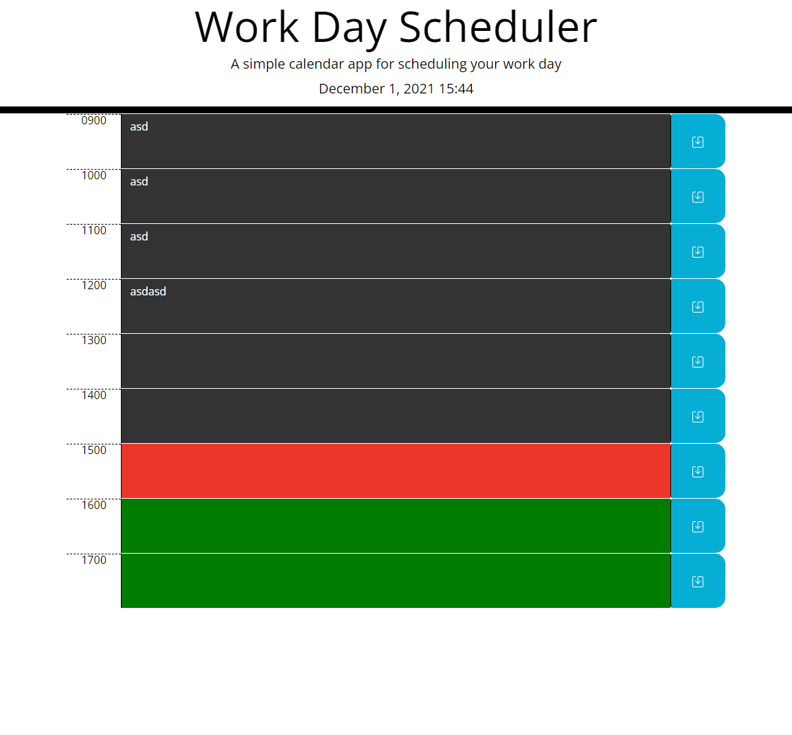

# Day Planner

[Deployed Site](https://dcrlsn.github.io/day-planner/)

## Table of Content

- [Usage](#Usage)
- [Description](#Description)

## Usage
Click on the hour in which you would like to save the task, enter your task then press the save button. the information is stored in local storage in your browser.

## Description
Quick day planner that allows you to save upcoming tasks at an upcoming working hour, colors hours depending on whether they're in the present, past or future.